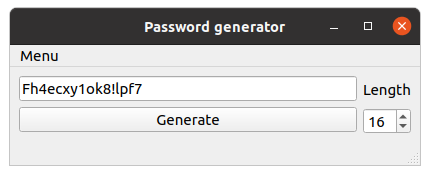

# Password generator

It is a simple password generator, created with Python and PyQT5.  
It is capable to generate passwords with required length and save them into 
files.



## Navigation
* [Installation](#installation)
    * [Python](#python)
    * [Windows](#windows)
        * [Notes](#notes)
    * [PyInstaller](#pyinstaller)
* [Releases](#releases)

## Installation

Clone this repository using command:
```shell script
git clone https://github.com/IHappyPlant/PasswordGeneratorGui.git
```

Then step into cloned repo using command:
```shell script
cd PasswordGeneratorGui
```

### Python
To install application directly into Python, run command:  
```shell script
python3 setup.py install
```
Installed package will be named ```password_generator```  
After installation, you can run it using command:
```shell script
python3 -m password_generator
```

### Windows
To install application in MS Windows, run commands:  
1. ```shell script
    python3 setup.py bdist_msi
    ```
2. Run built installer to install application.  

#### Notes
Windows 10 Defender may block installer, because it doesn't have signed 
certificate. Just ignore it.

### PyInstaller

You also may build executable file for your OS with PyInstaller.  
For this, you need to do next steps:    
 1. ```shell script
    pip3 install -r requirements.txt
    ```
 2. ```shell script
    pip3 install pyinstaller
    ```
 3. ```shell script
    pyinstaller password_generator/__main__.py
    ```
## Releases

You can also download created executable files for MS Windows and 
Debian/Ubuntu from releases.
